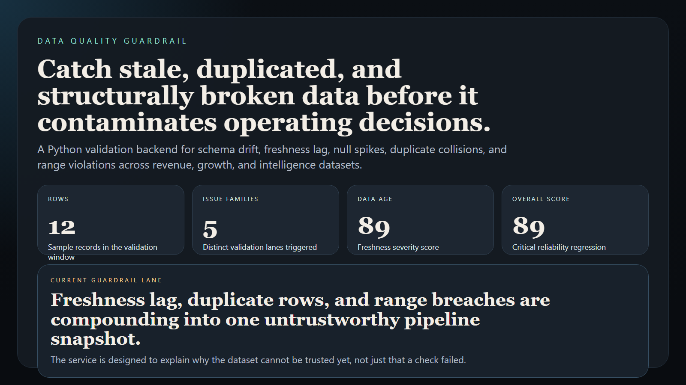
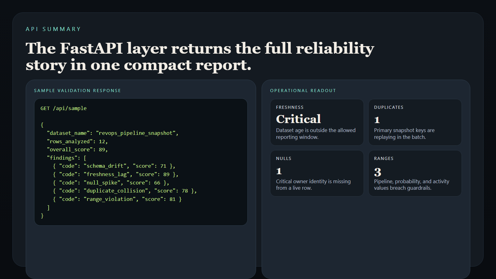
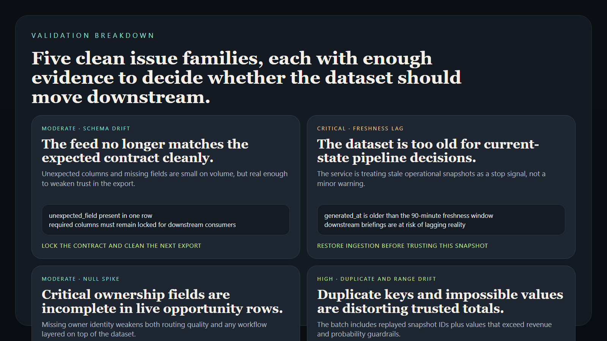
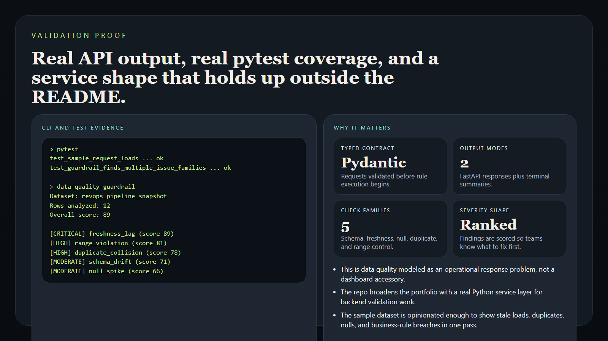

# Data Quality Guardrail

> **Python data-quality portfolio project** for schema drift, freshness, null, duplicate, and range validation across operator-owned datasets.

**Portfolio takeaway:** *"Data quality becomes operationally useful when failures are ranked, explained, and routed before they contaminate downstream decisions."*

---

## Project Overview

| Attribute | Detail |
|---|---|
| **Language** | Python |
| **Runtime Shape** | FastAPI + CLI |
| **Domain** | Dataset health and validation workflows |
| **Check Families** | schema drift · freshness lag · null spikes · duplicate collisions · range violations |
| **Output Modes** | JSON API · terminal summary |
| **Primary Users** | analytics engineering · revops ops · data platform |

---

## Executive Summary

Data Quality Guardrail models the sort of service teams use when operational reporting is only as trustworthy as the pipelines feeding it. Instead of treating dataset checks as a passive notebook exercise, the project ingests a structured dataset contract, runs high-signal validations against fresh records, scores the severity of what it finds, and returns evidence-backed issues with next actions.

The repo is intentionally built as a Python service layer rather than a frontend artifact. It shows how dataset reliability can be treated as an operating system concern: validate the shape, inspect the drift, score the damage, and route action before bad data pollutes forecasting, attribution, customer intelligence, or executive briefings.

---

## Validation Flow

```text
dataset contract + records
        |
        v
typed validation request
        |
        +--> schema drift checks
        +--> freshness lag checks
        +--> null spike checks
        +--> duplicate collision checks
        +--> range violation checks
        |
        v
severity-scored quality report
```

---

## Validation Families

### Schema Drift

- unexpected columns
- missing required columns
- type expectations that no longer match the feed

### Freshness Lag

- stale loads that undermine current-state reporting
- delayed ingestion windows on operational datasets

### Null Spike

- missing critical identifiers or metrics
- sudden completeness regression

### Duplicate Collision

- repeated primary keys or event identifiers
- inflated counts on downstream models

### Range Violation

- values outside accepted floors or ceilings
- unrealistic conversions, revenue, or health signals

---

## Usage

### Create a Virtual Environment

```bash
python -m venv .venv
.venv\Scripts\activate
pip install -e .[dev]
```

### Run the API

```bash
uvicorn app.main:app --reload
```

### Open the Docs

```text
http://127.0.0.1:8000/docs
```

### Run the CLI Summary

```bash
data-quality-guardrail
```

### Run the Tests

```bash
pytest
```

---

## Sample Output

```text
Data Quality Guardrail
======================
Dataset: revops_pipeline_snapshot
Rows analyzed: 12
Overall score: 89

[CRITICAL] freshness_lag (score 89)
Summary: Dataset freshness is materially outside the allowed reporting window.
```

---

## Screenshots

### Hero Capture



### API Summary



### Validation Breakdown



### Proof Layer



---

## Industry Applications

### Revenue Operations

- stop stale pipeline snapshots from distorting forecast and coverage calls
- catch duplicate opportunity rows before they inflate board-facing numbers

### Growth Analytics

- surface conversion-rate anomalies before attribution models drift
- flag null campaign fields before channel reporting is trusted too far

### Customer Intelligence

- prevent broken health-score feeds from contaminating churn or lifecycle views
- validate freshness on intervention datasets before operators act on them

---

## What This Demonstrates

- Python added meaningfully through a real validation service, not a token script
- Pydantic models and FastAPI used for operational data checks
- data quality modeled as a severity-ranked response problem
- CLI and API outputs shaped for real operator use
- evidence-backed reporting instead of vague “data looks off” summaries

---

## Future Enhancements

- add historical comparison windows for trend-aware alerting
- support CSV upload and object-store ingestion paths
- export markdown incident summaries for data-quality review
- add rule packs for SaaS revenue, lifecycle, and experimentation datasets
- emit webhook-ready escalation payloads for orchestration systems

---

## Tech Stack

[](https://www.python.org/)
[](https://fastapi.tiangolo.com/)
[](https://docs.pydantic.dev/)
[](https://docs.pytest.org/)

### Portfolio Links

- [LinkedIn](https://www.linkedin.com/in/mirzacausevic)
- [Kinetic Gain](https://kineticgain.com/)
- [Skills Page](https://mizcausevic.com/skills/)
- [GitHub](https://github.com/mizcausevic-dev)

---

*Part of [mizcausevic-dev's GitHub portfolio](https://github.com/mizcausevic-dev), with a focus on backend systems, growth operations, data reliability, and operational decision tooling.*
